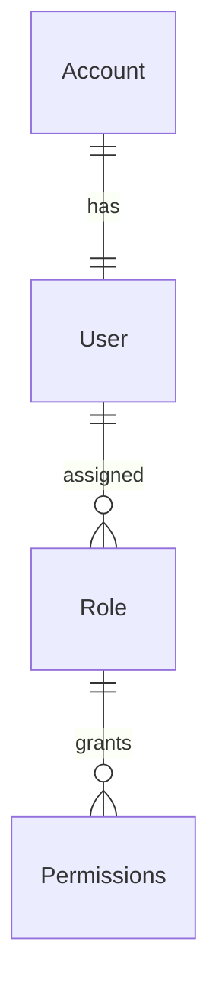

# Identity & Access Management

## Overview
Manages authentication, authorization, user roles, and security policies. Ensures proper access control within the platform.

## Core Entities
- **Account**: Handles authentication, security, and external login providers.
- **User**: Represents a person using the system.
- **Role**: Defines the permissions a user has (Admin, Recruiter, Freelancer).
- **Permissions**: Grants specific actions based on roles.

## Relationships
- **Account (1:1) User**: Every user must have exactly one account.
- **User (1:N) Roles**: A user can have multiple roles within the system.

## Key Features
- User registration and authentication (Email, OAuth, SSO).
- Role-based access control (RBAC).
- Multi-factor authentication (MFA).
- API token management for external integrations.

## Future Enhancements
- Fine-grained permission management.
- Integration with enterprise authentication providers (Azure AD, Okta).
