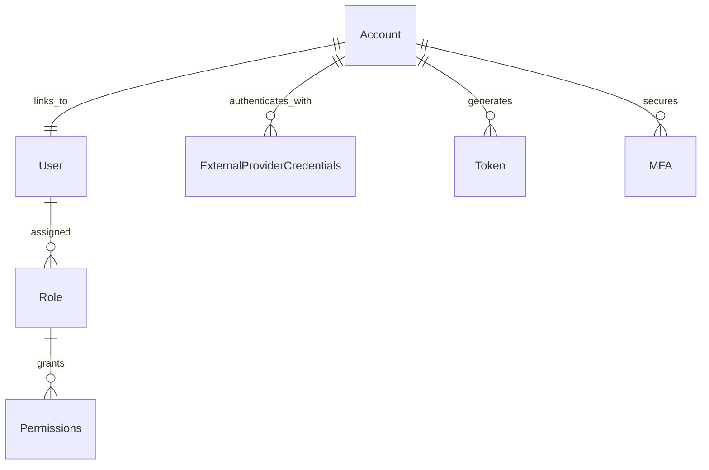

# Identity & Access Management

## Overview
Manages authentication, authorization, user roles, and security policies. Ensures proper access control within the platform.

## Core Entities

### **Entities Managed by Identity Server (OpenIddict)**
These entities handle **authentication**, token issuance, and external identity providers.
- **Account**: Represents an authenticated user.
- **External Provider Credentials**: OAuth providers (Google, GitHub, etc.).
- **Token**: OAuth2 Access & Refresh Tokens.
- **MFA (Multi-Factor Authentication)**: Stores second-factor authentication data.

### **Entities Managed by TFST API**
These entities handle **authorization** within the platform.
- **User**: Represents a person within TFST.
- **Role**: Defines a user's level of access (Admin, Recruiter, Freelancer).
- **Permissions**: Defines what actions roles can perform.

## Roles & Claims Strategy

### **Roles**
Roles are included in JWT claims and are used for API authorization.

- **Admin** (`admin` claim) → Full access to all system features.
- **User** (`user` claim) → Standard user access.
- **Manager** (`manager` claim) → Can manage organization resources.

### **Additional Claims**
Additional claims are used for finer control of user privileges.

- **Professional Profile** (`is_professional: true/false`) → Indicates if a user has a professional profile.
- **Organization Membership** (`organization_id: xyz`) → Links a user to an organization.

## Relationships

- **Identity Server**:
  - **Account (1:1) User**: Every Account is linked to a User in TFST.
  - **Account (1:N) External Provider Credentials**: A user can authenticate with multiple providers.
  - **Account (1:N) Tokens**: A user can have multiple active tokens.

- **TFST API**:
  - **User (1:N) Roles**: A user can have multiple roles.
  - **Role (1:N) Permissions**: Roles define permissions for system actions.

## Separation of Responsibilities

### **Identity Server (OpenIddict)**
- Handles **authentication** (login, OAuth, MFA).
- Issues **OAuth2 / OpenID Connect tokens**.
- Manages **user sessions** and **refresh tokens**.

### **TFST API**
- **Validates tokens** for each request.
- **Applies role-based access control (RBAC)**.
- **Protects resources** using claims from tokens.

## Key Features
- User registration and authentication (Email, OAuth, SSO).
- Role-based access control (RBAC).
- Multi-factor authentication (MFA).
- API token management for external integrations.

## Future Enhancements
- Fine-grained permission management.
- Integration with enterprise authentication providers (Azure AD, Okta).
