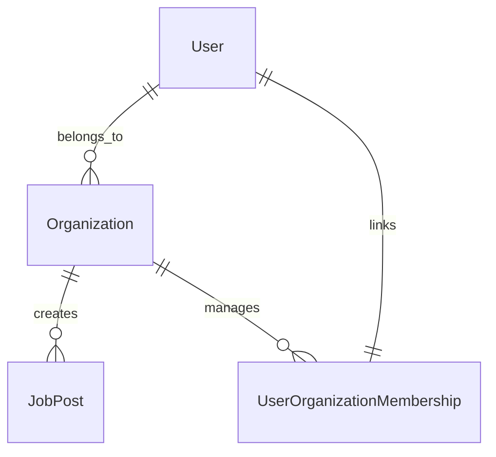

# Organizations & Team Management

## Overview
Supports companies and agencies in managing their teams, job postings, and talent acquisitions.

## Core Entities
- **Organization**: Represents a company or agency hiring freelancers.
- **User Organization Membership**: A link between users and organizations.
- **Recruiter**: A specialized user role within an organization.

## Relationships
- **User (0:N) Organizations**: A user can belong to multiple organizations.
- **Organization (1:N) Job Posts**: Companies post multiple jobs.

## Key Features
- Multi-user organization management.
- Role-based access for recruiters and HR teams.
- Centralized dashboard for tracking job posts and hires.

## Future Enhancements
- AI-driven hiring insights and team recommendations.
