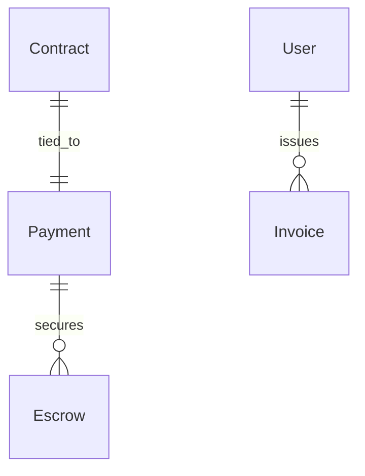

# Payments & Billing

## Overview
Handles secure payments, invoicing, and escrow-based transactions.

## Core Entities
- **Payment**: Represents a financial transaction between a freelancer and a client.
- **Invoice**: A generated document detailing work completed and payment requested.
- **Escrow**: A system to hold funds securely until contract completion.

## Relationships
- **Contract (1:1) Payment**: Payments are tied to contracts.
- **User (1:N) Invoices**: A freelancer can issue multiple invoices.

## Key Features
- Secure escrow-based payments.
- Automated invoicing based on work completion.
- Support for multiple payment methods (PayPal, Stripe, Crypto).

## Future Enhancements
- Blockchain-based escrow for transparent payments.
- Multi-party escrow and milestone-based payments.
