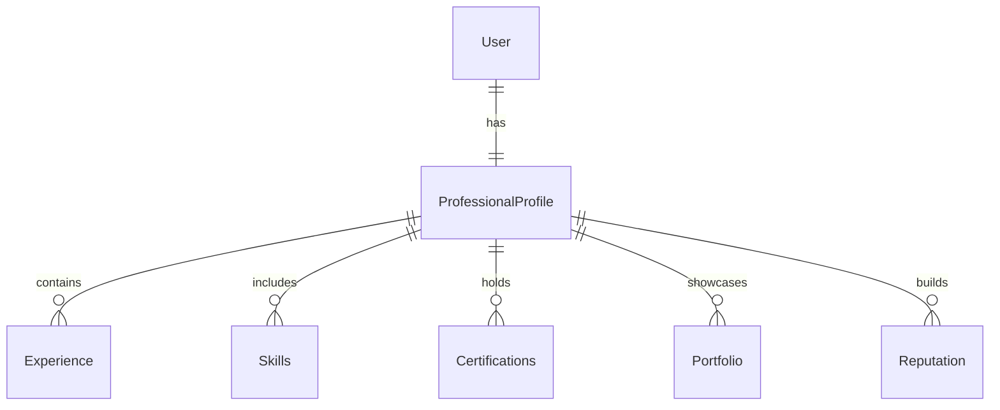

# Professional Profiles

## Overview
The **Professional Profile** module defines the identity of freelancers within TFST. It includes details such as skills, experience, certifications, and reputation.  
To ensure a **standardized and interoperable** representation of professional skills and occupations, TFST adopts the **European Skills, Competences, Qualifications, and Occupations (ESCO)** framework as the foundation for professional profiles.

## Alignment with ESCO
ESCO provides a structured **taxonomy** of skills, occupations, and qualifications, which TFST integrates directly. This allows:
- **Standardized skill representation** across different industries and regions.
- **Compatibility with European and international job markets.**
- **Support for 28 languages** without additional translation effort.
- **Better AI-driven recommendations** by leveraging a unified dataset.

[See ESCO here](https://esco.ec.europa.eu/)

## Core Entities

### **Professional Profile**
- Represents a freelancer’s **identity** and a professional background.
- Linked to **ESCO-based skills, occupations, and qualifications**.
- Contains **experience, endorsements, and reputation scoring**.

### **Experience**
- Work history including **roles, responsibilities, and durations**.
- Mapped to **ESCO occupations** for standardized job classification.

### **Skills**
- Skills are based on **ESCO’s structured taxonomy**.
- Each skill has:
  - **ESCO ID** → Unique identifier from ESCO.
  - **Name** → Standardized name from ESCO.
  - **Category** → Categorized based on ESCO’s classification.
  - **Source** → (ESCO, O*NET, SFIA, etc.) in case additional sources are integrated.

### **Certifications**
- Represents **validated qualifications** from recognized institutions.
- Can be linked to **ESCO qualifications** when available.
- Includes:
  - **Certificate Name**
  - **Issuing Institution**
  - **ESCO Qualification Reference (if applicable)**

### **Portfolio**
- Work samples that showcase a freelancer’s expertise.
- Can include links to **GitHub, Dribbble, Behance**, or other platforms.

### **Reputation**
- Ratings and feedback from completed projects.
- AI-driven **credibility scoring** based on work history and endorsements.

## Relationships
- **User (1:0..1) Professional Profile** → Only freelancers have a professional profile.
- **Professional Profile (1:N) Experience** → A freelancer can have multiple job experiences.
- **Professional Profile (1:N) Skills** → A freelancer has multiple skills.
- **Professional Profile (1:N) Certifications** → A freelancer can hold multiple certifications.
- **Professional Profile (1:N) Portfolio Items** → Multiple projects linked to a profile.
- **Professional Profile (1:N) Reputation Scores** → Different reputation metrics based on feedback.




## API Endpoints
TFST exposes an API to manage professional profiles using ESCO data.

### **Search ESCO Skills**
`GET /skills?query=software development&language=en`
```json
[
  { "id": "s-001", "name": "Software Development", "category": "Digital Skills", "source": "ESCO" },
  { "id": "s-002", "name": "Cloud Computing", "category": "IT Skills", "source": "ESCO" }
]
```

### **Get ESCO Occupations**
`GET /occupations?query=cloud architect`
```json
[
  { "id": "p-101", "name": "Cloud Architect", "isco_code": "2523", "source": "ESCO" }
]
```

### **Associate Skills to a Profile**
`POST /professional-profiles/{id}/skills`
```json
{
  "skills": ["s-001", "s-002"]
}
```

## Future Enhancements
- **AI-based skill gap analysis** → Suggest missing skills based on ESCO recommendations.
- **Automated profile completion** → Use ESCO metadata to suggest relevant experiences and qualifications.
- **Integration with LinkedIn & GitHub** → Import existing skills and projects.

## Why ESCO?
Using **ESCO as the foundation** for TFST’s professional profiles ensures that:
- Skills and occupations **follow an international standard**.
- The system is **future-proof**, supporting integrations with global job markets.
- Multilingual support is **natively available**.
- TFST can **extend ESCO** by integrating O*NET, SFIA, and MAPHA where necessary.
