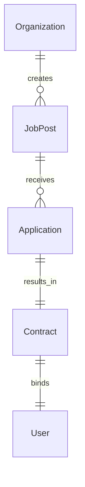

# Talent Hiring & Contracts

## Overview
Manages job postings, applications, interviews, contracts, and hiring workflows.

## Core Entities
- **Job Post**: A listing created by a client or recruiter to hire freelancers.
- **Application**: A freelancer's submission to a job post.
- **Interview**: The hiring process, including technical screenings.
- **Contract**: A formal agreement between a client and a freelancer.

## Relationships
- **Organization (1:N) Job Posts**: A company can post multiple jobs.
- **Job Post (1:N) Applications**: A job can receive multiple applications.
- **Application (1:1) Contract**: A contract is created upon hiring.

## Key Features
- AI-based talent matching.
- One-click application system.
- Smart contract execution for milestone payments.

## Future Enhancements
- AI-driven job descriptions.
- Decentralized arbitration system for contract disputes.
