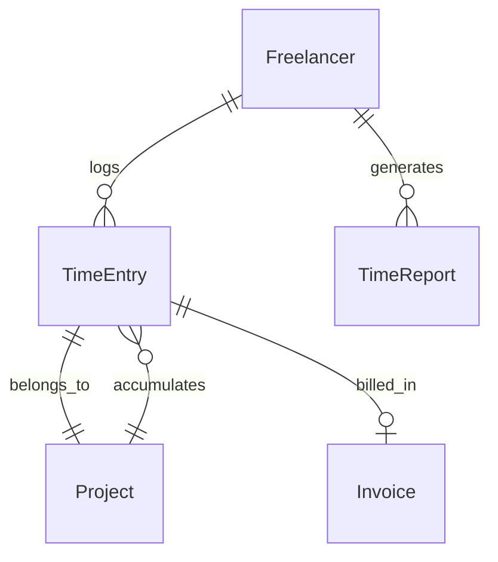

# Time Tracking & Reporting

## Overview
The **Time Tracking & Reporting** module provides freelancers with a built-in tool to log work hours, manage time entries, and generate reports or invoices based on hourly rates.

This tool is **free for all freelancers** registered on TFST and integrates with the **Payments & Billing** module to facilitate automated invoicing.

## Core Entities

### **Time Entry**
- Represents a freelancer’s logged work session.
- Includes:
  - **Date** → The date when the work was done.
  - **Hours Worked** → Total number of hours worked on that date.
  - **Project Reference** → Links the entry to a specific project.
  - **Task Reference (Optional)** → Links the entry to a specific task.
  - **Hourly Rate** → Defined by the freelancer or contract.
- **Flexible Input**:
  - Freelancers **can log hours without specifying a start/end time**.
  - Example:  
    - ✅ **"Worked 5 hours today on Project X."**  
    - ✅ **"Spent 3 hours on API Development this week."**

### **Project**
- Represents a freelance job or contract where time entries are recorded.
- Includes:
  - **Client Reference** → Links the project to a specific client.
  - **Freelancer Reference** → Assigned freelancer.
  - **Hourly Rate** → Base rate for invoicing.
  - **Status** → (Active, Completed, Canceled).

### **Invoice (Linked to Payments & Billing)**
- Invoices can be **automatically generated** from tracked hours.
- Calculation:  
  `Total Amount = Total Hours Worked x Hourly Rate`
- Invoices are stored in the **Payments & Billing** module.

### **Time Report**
- A summarized view of logged hours per:
  - **Project**
  - **Client**
  - **Time Period**
  - **Task** (if applicable)
- Used for internal tracking or invoicing purposes.

## Relationships
- **Freelancer (1:N) Time Entries** → A freelancer logs multiple time entries.
- **Project (1:N) Time Entries** → A project accumulates multiple time logs.
- **Time Entry (1:1) Invoice** → Time logs can be grouped into invoices.
- **Freelancer (1:N) Reports** → Freelancers generate reports from tracked hours.

## **Validation & Approval Workflows**
As the system evolves, different levels of validation will be introduced:

1. **Self-Managed Mode (Default)**
   - Freelancers log their own hours without external validation.
   - Designed for **personal tracking and reporting**.

2. **Supervised Validation (For Consultancies & Teams)**
   - Project managers can **review and approve hours** before invoicing.
   - Supports **custom approval workflows** (e.g., weekly or monthly reviews).

3. **Automated Validation (Future)**
   - Integration with **time tracking tools** (e.g., Toggl, Clockify, Jira).
   - AI-based validation using **activity logs, commits, and project interactions**.

4. **Smart Contracts for Payments (Future)**
   - Validated hours trigger **automatic payments** via **escrow-based smart contracts**.
   - Ensures transparency between freelancers and clients.

## Key Features
- **Simple Time Logging**
  - Freelancers select a **date** and input total **hours worked**.
  - No need for start/end times.
  
- **Project-based Hourly Rates**
  - Set different rates per client or project.
  - Supports **fixed-price** or **hourly** contracts.

- **Automated Invoice Generation**
  - Converts time entries into **invoices** (when enabled).
  - Supports **partial payments** for ongoing projects.

- **Comprehensive Time Reports**
  - Filters by **date range, project, client**.
  - Export to **PDF, XLSX, CSV** for client reporting.
## Future Enhancements
- **AI-based time tracking** → Smart recommendations for logging hours.
- **Task-Level Tracking** → Assign time entries to specific tasks.
- **Mobile App Support** → Native mobile app for real-time tracking.
- **Blockchain Validation** → Immutable proof of work logs.