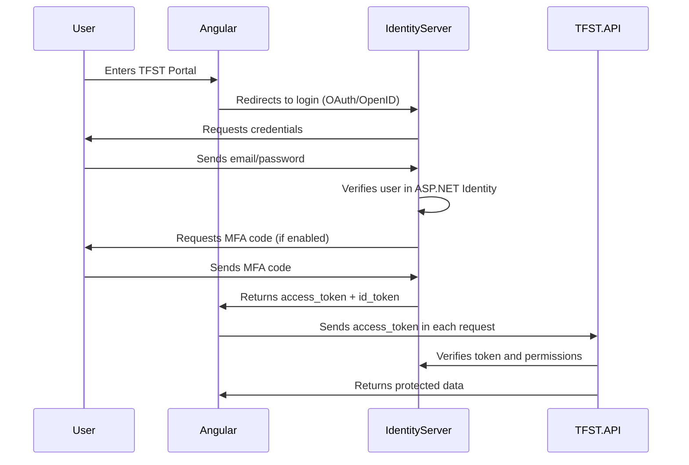
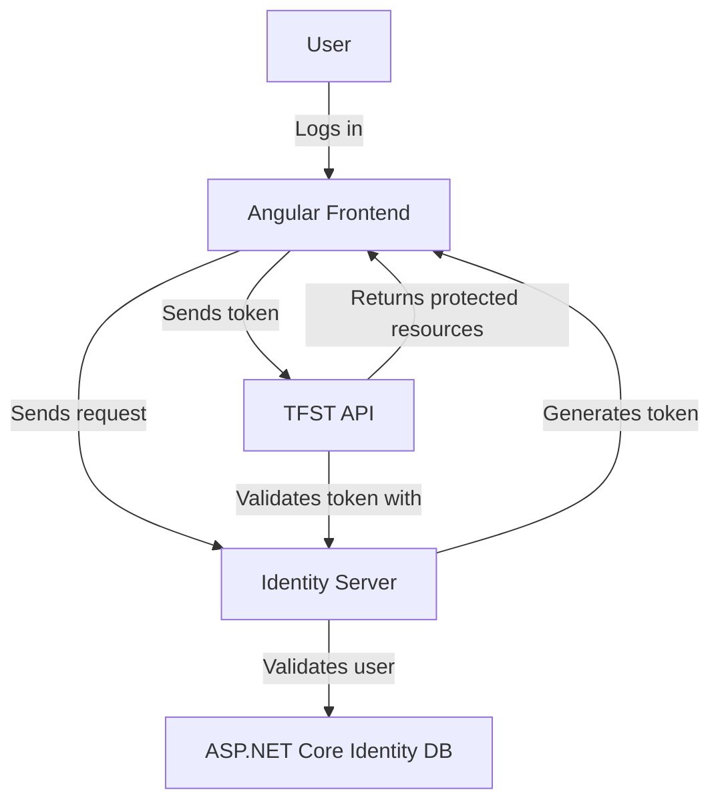
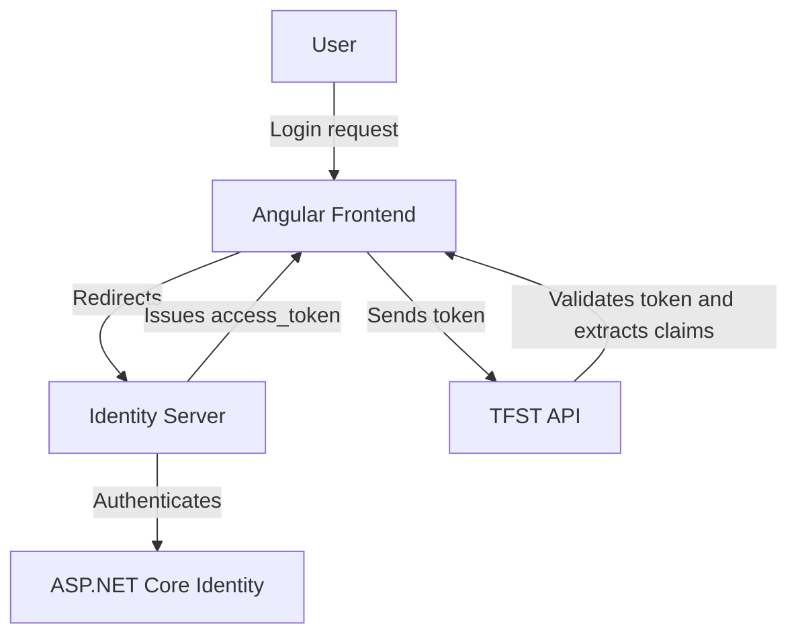

# Identity & Access Management Features

## Feature: User Authentication & Login
- **User Story:**  
  *As a user, I want to log into TFST securely using email/password or external authentication, so I can access my account.*
- **Next Level:**  
  - Multi-Factor Authentication (MFA).  
  - Support for OAuth providers (Google, GitHub, LinkedIn).  

## Feature: Authorization & Role Management
- **User Story:**  
  *As an admin, I want to assign roles and permissions to users, so I can control what actions they can perform.*
- **Next Level:**  
  - Fine-grained permission management.  
  - Role-based access control (RBAC).  

## Feature: API Authentication with OAuth2 & JWT
- **User Story:**  
  *As a developer, I want to authenticate API requests using OAuth2 tokens, so I can access protected resources securely.*
- **Next Level:**  
  - Token expiration & refresh tokens.  
  - API scopes for granular permissions.  

## Feature: Single Sign-On (SSO)
- **User Story:**  
  *As a user, I want to log in once and access multiple services within TFST, so I don’t have to re-authenticate.*
- **Next Level:**  
  - Support for SAML or OpenID Connect for enterprise integrations.  
  - Session management across multiple portals.

---
## Frontend vs Backend Authentication Responsibilities

### **Frontend (Angular)**
- Stores and manages `access_token` and `id_token`.
- Uses silent authentication to refresh tokens (if configured).
- Handles user session state (logged-in/out).
- Redirects users to Identity Server for login and logout.
- Stores `claims` from the token to manage UI-based access control.

### **Backend (TFST API)**
- Validates tokens on every request.
- Extracts **claims** from the token to enforce permissions.
- Cancels sessions when roles or permissions change.

---

### **Autentication Sequence Diagram**

### Components Diagram

### Responsibilities

