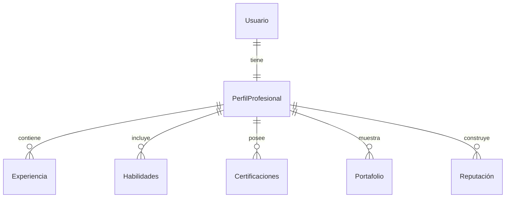

# Perfiles Profesionales

## Resumen
El módulo **Perfil Profesional** define la identidad de los freelancers dentro de TFST. Incluye detalles como habilidades, experiencia, certificaciones y reputación.

Para garantizar una representación **estandarizada e interoperable** de las habilidades y ocupaciones profesionales, TFST adopta el marco **Europeo de Habilidades, Competencias, Cualificaciones y Ocupaciones (ESCO)** como base para los perfiles profesionales.

## Alineación con ESCO
ESCO proporciona una **taxonomía** estructurada de habilidades, ocupaciones y cualificaciones, que TFST integra directamente. Esto permite:
- **Representación estandarizada de habilidades** en diferentes sectores y regiones.
- **Compatibilidad con los mercados laborales europeos e internacionales.**
- **Compatibilidad con 28 idiomas** sin necesidad de traducción adicional.
- **Mejores recomendaciones basadas en IA** al aprovechar un conjunto de datos unificado.

[Ver ESCO aquí](https://esco.ec.europa.eu/)

## Entidades Principales

### **Perfil Profesional**
- Representa la **identidad** y la trayectoria profesional del freelance.
- Vinculado a las **competencias, ocupaciones y cualificaciones de ESCO**.
- Contiene **experiencia, recomendaciones y calificación de reputación**.

### **Experiencia**
- Historial laboral, incluyendo **roles, responsabilidades y duración**.
- Asignado a las **ocupaciones de ESCO** para la clasificación estandarizada de puestos.

### **Habilidades**
- Las habilidades se basan en la **taxonomía estructurada de ESCO**.
- Cada habilidad tiene:
- **ID de ESCO** → Identificador único de ESCO.
- **Nombre** → Nombre estandarizado de ESCO.
- **Categoría** → Categorizada según la clasificación de ESCO.
**Fuente** → (ESCO, O*NET, SFIA, etc.) en caso de que se integren fuentes adicionales.

### **Certificaciones**
- Representa **cualificaciones validadas** de instituciones reconocidas.
- Puede vincularse a **cualificaciones de ESCO** cuando estén disponibles.
- Incluye:
- **Nombre del certificado**
- **Institución emisora**
- **Referencia de la cualificación de ESCO (si corresponde)**

### **Portafolio**
- Muestras de trabajo que demuestran la experiencia del freelancer.
- Puede incluir enlaces a **GitHub, Dribbble, Behance** u otras plataformas.

### **Reputación**
- Calificaciones y comentarios de proyectos completados.
- **Puntuación de credibilidad** basada en IA, basada en el historial laboral y las recomendaciones.

## Relaciones
- **Perfil profesional de usuario (1:0-1)** → Solo los freelancers tienen un perfil profesional. - **Perfil Profesional (1:N) Experiencia** → Un freelancer puede tener múltiples experiencias laborales.
- **Perfil Profesional (1:N) Habilidades** → Un freelancer tiene múltiples habilidades.
- **Perfil Profesional (1:N) Certificaciones** → Un freelancer puede tener múltiples certificaciones.
- **Perfil Profesional (1:N) Elementos del Portafolio** → Múltiples proyectos vinculados a un perfil.
- **Perfil Profesional (1:N) Puntuaciones de Reputación** → Diferentes métricas de reputación basadas en comentarios.



## Puntos de conexión de la API
TFST expone una API para gestionar perfiles profesionales utilizando datos de ESCO.

### **Buscar habilidades ESCO**
`GET /skills?query=software development&language=en`
```json
[
{ "id": "s-001", "name": "Desarrollo de software", "category": "Habilidades digitales", "source": "ESCO" },
{ "id": "s-002", "name": "Computación en la nube", "category": "Habilidades de TI", "source": "ESCO" }
]
```

### **Obtener ocupaciones ESCO**
`GET /occupations?query=arquitecto de nube`
```json
[
{ "id": "p-101", "name": "Arquitecto de nube", "isco_code": "2523", "source": "ESCO" }
]
```

### **Asociar habilidades a un perfil**
`POST /professional-profiles/{id}/skills`
```json
{
"skills": ["s-001", "s-002"]
}
```

## Mejoras futuras
- **Análisis de carencias de habilidades basado en IA** → Sugiera las habilidades que faltan según las recomendaciones de ESCO.
- **Completado automático de perfiles** → Utilice los metadatos de ESCO para sugerir experiencias y cualificaciones relevantes.
- **Integración con LinkedIn y GitHub** → Importe habilidades y proyectos existentes.

## ¿Por qué ESCO?
Utilizar **ESCO como base** para los perfiles profesionales de TFST garantiza que:
- Las habilidades y ocupaciones **siguen un estándar internacional**.
- El sistema está **a prueba de futuro** y admite integraciones con mercados laborales globales.
- Soporte multilingüe disponible de forma nativa. - TFST puede **ampliar ESCO** integrando O*NET, SFIA y MAPHA cuando sea necesario.