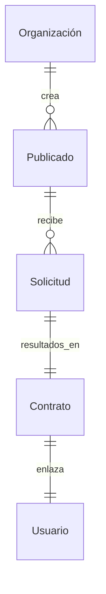

# Contratación de Talento y Contratos

## Resumen
Gestiona las publicaciones de empleo, solicitudes, entrevistas, contratos y flujos de trabajo de contratación.

## Entidades Principales
- **Publicado**: Una lista creada por un cliente o reclutador para contratar freelancers.
- **Solicitud**: El envío de un freelancer a un puesto de trabajo.
- **Entrevista**: El proceso de contratación, incluyendo las evaluaciones técnicas.
- **Contrato**: Un acuerdo formal entre un cliente y un freelancer.

## Relaciones
- **Publicaciones de empleo de la organización (1:N)**: Una empresa puede publicar múltiples empleos.
- **Solicitudes de empleo de la publicación (1:N)**: Un empleo puede recibir múltiples solicitudes.
- **Contrato de solicitud (1:1)**: Se crea un contrato al contratar.

## Características principales
- Identificación de talentos basada en IA.
- Sistema de postulación con un solo clic.
- Ejecución inteligente de contratos para el pago de hitos.

## Mejoras futuras
- Descripciones de puestos basadas en IA.
- Sistema de arbitraje descentralizado para disputas contractuales.

