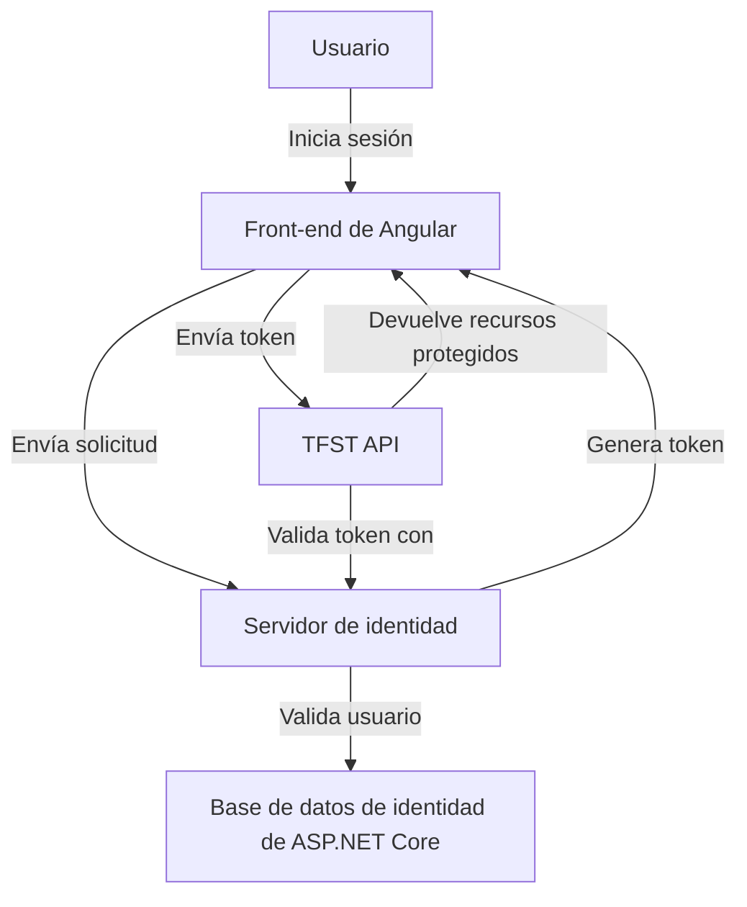
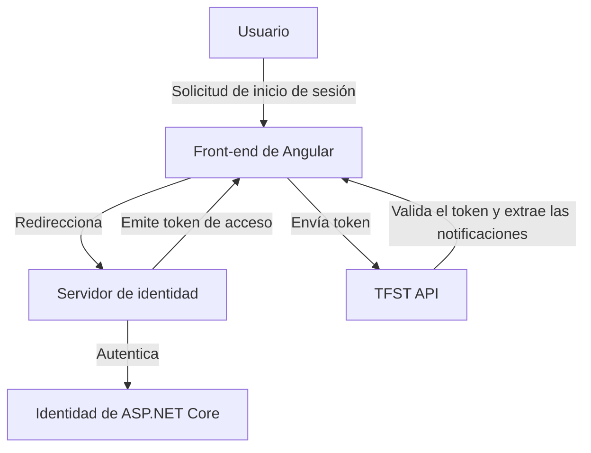

# Funciones de Gestión de Identidad y Acceso

## Función: Autenticación e inicio de sesión de usuario
- **Historia del usuario:**

*Como usuario, quiero iniciar sesión en TFST de forma segura mediante correo electrónico/contraseña o autenticación externa para poder acceder a mi cuenta.*
- **Siguiente nivel:**

- Autenticación multifactor (MFA).

- Compatibilidad con proveedores de OAuth (Google, GitHub, LinkedIn).

## Función: Autorización y gestión de roles
- **Historia del usuario:**

*Como administrador, quiero asignar roles y permisos a los usuarios para poder controlar las acciones que pueden realizar.*
- **Siguiente nivel:**

- Gestión de permisos precisa.

- Control de acceso basado en roles (RBAC).

## Función: Autenticación de API con OAuth2 y JWT
- **Historia de usuario:**

*Como desarrollador, quiero autenticar las solicitudes de API mediante tokens OAuth2 para poder acceder a recursos protegidos de forma segura.*
- **Nivel superior:**

- Tokens de caducidad y actualización de tokens.

- Ámbitos de API para permisos granulares.

## Función: Inicio de sesión único (SSO)
- **Historia de usuario:**

*Como usuario, quiero iniciar sesión una vez y acceder a varios servicios dentro de TFST, para no tener que volver a autenticarme.*
- **Nivel superior:**

- Compatibilidad con SAML u OpenID Connect para integraciones empresariales.

- Gestión de sesiones en varios portales.

---
## Responsabilidades de autenticación frontend vs. backend

### **Frontend (Angular)**
- Almacena y gestiona `access_token` e `id_token`. - Utiliza autenticación silenciosa para actualizar los tokens (si está configurado).
- Gestiona el estado de la sesión del usuario (iniciado/cerrado).
- Redirige a los usuarios al Servidor de Identidad para iniciar y cerrar sesión.
- Almacena las notificaciones del token para gestionar el control de acceso basado en la interfaz de usuario.

### **Backend (TFST API)**
- Valida los tokens en cada solicitud.
- Extrae las notificaciones del token para aplicar los permisos.
- Cancela las sesiones cuando cambian los roles o los permisos.

---

### **Diagrama de secuencia de autenticación**
```mermaid
sequenceDiagram
participante Usuario
participante Angular
participante IdentityServer
participante TFST.API

Usuario -> Angular: Accede al portal de TFST
Angular -> IdentityServer: Redirecciona al inicio de sesión (OAuth/OpenID)
IdentityServer -> Usuario: Solicita credenciales
Usuario -> IdentityServer: Envía correo electrónico/contraseña
IdentityServer -> IdentityServer: Verifica el usuario en ASP.NET Identity
IdentityServer -> Usuario: Solicita código MFA (si está habilitado)
Usuario -> IdentityServer: Envía código MFA
IdentityServer -> Angular: Devuelve el token de acceso + el token de identificación
Angular -> TFST.API: Envía el token de acceso en cada solicitud
TFST.API -> IdentityServer: Verifica el token y los permisos
TFST.API -> Angular: Devuelve datos protegidos
```

### Diagrama de componentes



### Responsabilidades

